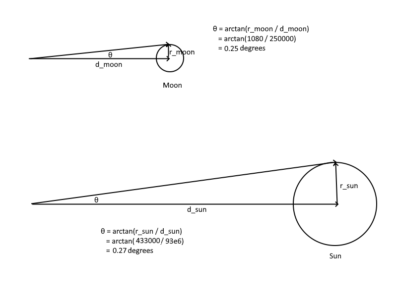
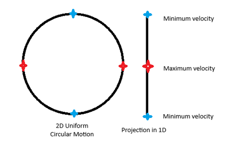

# Chapter 3: The Dream

Navigator Kara had a dream that night about a solar eclipse. It was like something she saw when she was a little girl of about 8 but surprisingly different than the experience she recounted. It felt like several different memories of others pieced together and she was experiencing them all at once. When she awoke, before the dream scattered into nothingness, she grabbed her voice recorder beside her bed and started narrating.

STARTING RECORDING:

I was lying outside under the shade of a tree on a sunny day reading from the book *Einstein and the Total Eclipse** *by Peter Coles in the chapter on the Anatomy of an Eclipse. I heard myself read these words:

“But the possibility of having a total eclipse relies on one extraordinary and fascinating coincidence. The Moon is much closer to us than the Sun is (250,000 miles compared to 93 million), but is also very much smaller (its diameter is just over 2000 miles, while the sun is about 900,000 miles across). Somehow these numbers have conspired with the laws of trigonometry to produce a situation in which the apparent size of the Moon’s disk is almost exactly the same as that of the Sun. There is no convincing explanation of how this remarkable coincidence came about, but without it total eclipses would be impossible.”

I paused and took out a pen. I found a blank page on a notepad and drew a diagram on there to do some basic calculations to confirm what the author stated. I know the moon is approximately 1080 miles in radius and the sun is approximately 433,000 miles in radius so I will use those values instead of the book-given one. 

Calculations indicate angular radius of moon to be 0.25 degrees and that of sun to be 0.27 degrees. However, since the distance to the moon and sun both varies since the orbit is elliptical and not perfectly circular, there are epoch intervals when both of those coincide with each other. 

This was simple enough math but sometimes it feels good to prove things by paper and pencil instead of just trusting what is written on paper.

The air suddenly grew cooler. Is there a storm coming? I looked up and saw that the sun was slowly being occluded by a shadowy object would could only be the moon. “Strange! I didn’t think there was a solar eclipse predicted for today. It’s not even the new moon and eclipses can only happen during the new moon.”

An unbidden voice came to her mind and instinctively she knew these were the words written by Annie Dillard on the impossibility of capturing a sight via a photograph. *The lenses of telescopes and cameras can no **more** cover the breadth and scale of the visual array than language can cover the breadth and simultaneity of internal experience. Lenses enlarge the sight, omit its context, and make of it a pretty and sensible picture, like something on a Christmas card.*

Who was Annie Dillard? I think she’s an American author who wrote a lot about nature poetically with frequent references to science. I’m not known to remember quotes by anyone so being able to recite this from memory felt strange.

What was equally peculiar is to see everything in the crystal light of sudden twilight converging towards darkness. There’s also a feeling of impending doom. The eclipse should only last a few minutes and then it would be over but that wasn’t the feeling I felt then. I felt it would come and then last forever. This would have contradicted every aspect of celestial mechanics but that feeling resided there. The moon cannot stop its motion or else it would quickly collide with Earth due to gravity. It was in perpetual free fall. The only way would be for the moon to stay exactly where it is while blocking the sun would be for it to also counteract gravity exactly by accelerating in a direction radially outwards.

These thoughts, useless as they might be, were going through my brain while observing this phenomenon. I recalled years ago at a tender age of 8 seeing the 2024 solar eclipse in Dallas, TX. That was the pivotal moment then which led me to want to learn more about celestial motion. All that led me down the path of studying physics and then later aerospace.

But what does all this have to do with now? Simply that the eclipse was not disappearing. It seemed to persist. A sudden bell-like gong rang in my mind. It reverberated. Then, a calm feminine voice akin to one from a meditation video or a yoga teacher resonated in my mind. 

*There is no life without change. **Read A Day Curated** in the Poetry section of the book** you are part of**.*

The words made no sense to me. The sky was still half-black in that eclipse twilight. “What does that mean?”

The voice only repeated itself again with the same words.

“This is not helping. What book is this and what do you mean I’m part of a book?”

Once again, there was no change in the words that continued to be spoken in my mind. Just as I was about to feel like I was slowly going insane, the voice stopped. At the same time, time seemed to have started again. I could see a tiny sliver of the sun poking through the previously completely covered up circle. The moon was moving again.

A whisper began very close to my ears. “Dynamic balance is essential to the way of the unity of opposites.”

It was a different voice than before. This was not spoken calmly but in a sense of desperate urgency. Startled, I looked around but saw no one in my vicinity. More whispers started from an ever-growing number of invisible entities. Some seemed to be right next to my ears while others seemed to be inside my skull. 

The voices repeated abstract notions. “The unity is a process which now lets in the dark and now the light. Like the orbit of a planet around a star, there is periapsis and there is apoapsis. There is distance and there is nearness. Everything changes in the system but the system itself does not change.” 

“Who are you? What do you want?” I yelled.

There was no acknowledgement. The voices only continued. “Consider even the motion of a simple ball moving clockwise around a circle with constant speed. Project its motion into a 1D plane as if capturing a shadow. In the projection, it slows down as it reaches the edge, turns around and accelerates again only to slow down once more – and so the endless cycle continues. An oscillation between two opposite points. Is this evident to you?”

Hoping the voice would stop, I said. “Give me a moment and let me do the math. For simplicity, I’ll consider the initial condition at t=0 to be at (r,0).”

I flipped to the next page of my notepad and wrote down the Cartesian coordinates describing uniform circular motion. Then, I looked at the y-component of it and took the derivative.

y=-rωcosωt

ω=2π/T where T is the period

where the Greek letter omega is the angular velocity defined as radians per second, t is the time in seconds and r is the radius of the circle. 

I narrated as I described the results, “In this equation, y-dot (the y-component of the velocity which is also the shadow velocity) is 0 when t is a quarter of the period or three quarters of the period. It is maximum when t is equal to 0 or half of the period. Translated into position space, this means that the shadow moves fastest when the ball is at (+r,0) or (-r,0) and it moves slowest when the ball is at (0, -r) and (0, +r).”

“You can do the math but do you realize the deeper meaning with this analogy?” 

I felt that I knew the answer but I was not 100% certain. I replied. “I can guess but why don’t you tell me?”

There as a brief pause before the voice continued. “Polarities that exists in lower dimensions do not exist in higher dimensions. The extremity of the velocity observed in 1D is but uniformity from a 2D perspective.”

I nodded. This is still insane but at least a conversation was happening. “You mean to say that we cannot understand why opposites consistently occur in our world but this is because we lack an understanding from our limited perspective. This is one of the oldest concepts in human philosophy and religion. The nature of duality and the concept of change. What does this have to do with me?”

 

